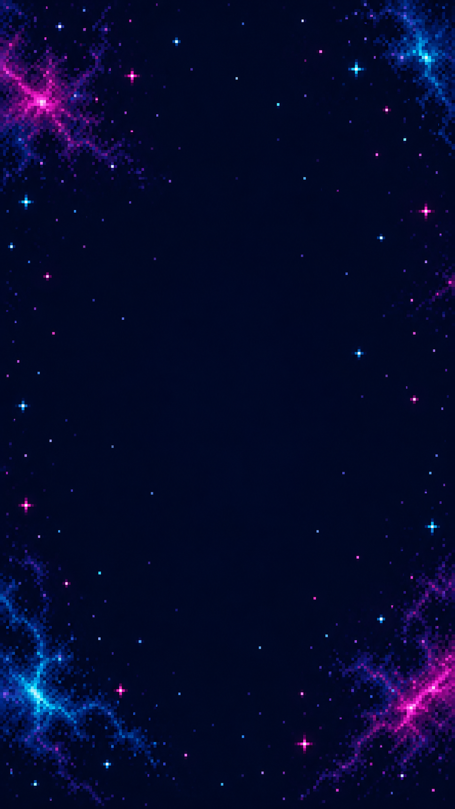

# Neon Breaker Duo

A portrait-only, two-player online brick breaker: share one board, return the ball together, and clear three neon sectors. The 9:16 playfield scales to the available screen; players do not need to choose an orientation.

## Live Demo

- [Play Neon Breaker Duo · Playtest v0.0.12](https://samuelasherrivello.github.io/babylon-lite-arkanoid-clone/)

## Table of Contents

1. [Getting Started](#getting-started)
2. [How to Play](#how-to-play)
3. [Multiplayer](#multiplayer)
4. [Art and References](#art-and-references)
5. [Project Details](#project-details)
6. [Original AI Prompt](#original-ai-prompt)
7. [Credits](#credits)

## Getting Started

The shared online server is already deployed; two players can connect from separate browser tabs or devices.

### Run the game

From the repository root, install dependencies and start Vite:

```powershell
npm install
$env:VITE_MULTIPLAYER_URL = "https://rmc-colyseus-multiplayer-server.vercel.app"
npm run dev
```

Open the localhost address printed by Vite in two independent browser sessions and play together. To use a locally running backend, set `VITE_MULTIPLAYER_URL` to its URL (the shared server defaults to `http://127.0.0.1:2567`) before starting Vite.

Run checks and produce the GitHub Pages build from the repository root:

```powershell
npm test
npm run build
```

The application requires WebGPU. Use a current browser and GPU configuration that supports WebGPU; if unavailable, the page explains the limitation.

## How to Play

Both players defend the same shared 320×576 playfield and can move their paddles across the full width, including to the same position. Player 1's paddle is at y=490 (50 pixels above the old bottom row); Player 2's is at y=440 (100 pixels above it). Either paddle can return a falling ball at its own row.

| Action | Control |
|---|---|
| Move | A/D or left/right arrows; drag/touch anywhere across the playfield |
| Launch a waiting ball | Space or **LAUNCH** |
| Pause this device | P or **PAUSE**; your partner and shared match continue |
| Resume | P or **RESUME** |
| Restart after the team wins or loses | **PLAY AGAIN** / **RESTART** |

Clear three authored waves. Normal bricks award 10 points; reinforced bricks award 25. The team shares three lives. A powerup drops from a broken brick at a one-in-eight chance: wide paddles last eight seconds, while multiball adds a ball up to a cap of three.

## Multiplayer

The shared Colyseus server owns full-width paddle bounds, each paddle's y coordinate, ball movement, collisions, bricks, scores, lives, powerups, waves and match outcomes. The local paddle is predicted from current input for immediate feedback, while remote paddle snapshots are interpolated across an adaptive render buffer whose clock never rewinds when network jitter changes the delay; these presentation steps never change server-owned collisions or scoring. The game supports two connected players. A third player sees the full-room state and can retry later. A late joiner receives the current board snapshot. A departing player's paddle centers at its assigned y and becomes available; reconnecting creates a fresh anonymous player identity.

Sessions are in-memory and ephemeral. They can reset after all players leave or during hosting/deployment interruptions. There are no accounts, persistent identity, durable scores, room codes, or offline single-player fallback. GitHub Pages serves the static frontend; the multiplayer backend runs separately at the secure endpoint configured above. The client is pinned to the [shared multiplayer client v0.9.6](https://github.com/SamuelAsherRivello/rmc-colyseus-multiplayer-server/releases/tag/v0.9.6).

## Art and References

<a href="neon-breaker-duo/documentation/neon-space-background.png"></a>

- [Arkanoid: Revenge of Doh](https://en.wikipedia.org/wiki/Arkanoid:_Revenge_of_Doh) — primary gameplay reference for paddle-and-ball brick breaking and arcade progression.
- [itch.io HTML5 Arkanoid games](https://itch.io/games/html5/tag-arkanoid) — optional gameplay research for browser presentation and control ideas; no game assets or code are included.
- `neon-breaker-duo/documentation/neon-space-background.png` — original background generated for this project with OpenAI image generation.
- `neon-breaker-duo/src/content/babylon/images/neon-brick-atlas.png` — original pixel-cluster atlas reproducibly generated by `neon-breaker-duo/documentation/generate-neon-atlas.mjs`; bricks, paddles, ball and powerups are not copied from reference games.

The identity, stage layout, board patterns, sprites, UI and title are original. No third-party game artwork or audio is bundled; this version has no audio.

## Project Details

- `neon-breaker-duo/` is the React/Vite app; `neon-breaker-duo/src/content/` contains the Babylon Lite WebGPU renderer and sprite presentation.
- `neon-breaker-duo/src/game/` contains network session state and full-width paddle input mapping.
- `neon-breaker-duo/test/` covers app configuration, renderer setup, controls and Pages paths.
- `openspec/changes/archive/2026-10-01-arkanoid-co-op-multiplayer/` contains the completed change and acceptance tasks.
- [`@babylonjs/lite`](https://www.npmjs.com/package/@babylonjs/lite) provides the required Babylon Lite runtime; pixel-art textures use nearest sampling, no mipmaps, no MSAA, and DPR-aware integer scaling when the stage fits.

## Original AI Prompt

<details>
<summary>Read the full original prompt (edited for grammar, punctuation, spelling, and formatting)</summary>

```text
Update this game to be a multiplayer 2D Pixel Perfect clone of Arkanoid.

https://en.wikipedia.org/wiki/Arkanoid:_Revenge_of_Doh
```

</details>

## Credits

- Samuel Asher Rivello — over 25 years of game development experience (2026).
- [GitHub](https://github.com/SamuelAsherRivello/) · [LinkedIn](https://Linkedin.com/in/SamuelAsherRivello)
- Provided as-is under the [MIT License](LICENSE). Copyright © 2026 Rivello Multimedia Consulting, LLC.

